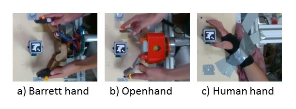

# Asterisk_Test_Instructions

**Make sure to open this file in Visual Studio Code with the Markdown Viewer**

0. Connect the observer to zoom and anydesk remote desktop
1. Set up three terminal windows
2. Get physical setup ready
3. check over checklist
4. Do the trial!
5. stop the camera data collection
6. repeat!

---
## 0. Connect the observer

Someone will watch the trials to make sure everything is going correctly, this will be John/Anjali. They will be connected through in zoom and through a remote desktop client, anydesk.

### Zoom

It's installed on the computer. Open the client and log in. Open the following zoom room:

If its John:  

    https://oregonstate.zoom.us/j/9083920230

If its Anjali:

    https://oregonstate.zoom.us/j/9841644376

... (add more rooms later for all observers)

### Anydesk
It's installed. Give them the anydesk client id and approve their connection request: 

    390 098 910

---
## 1. Set up terminal windows

Open 3 terminal windows. 
>**Note:** It might be more helpful to open 3 *tabs* in one terminal window or you can use the *terminator* program to open 3 visible terminal windows in one window using the **[crtl+o]** shortcut.

>**Note 2:** There might be other terminals open from a previous trial. Use [crtl + alt + up/down arrow] to check the other workspaces.

In terminal 1, run:

    roslaunch realsense2_camera rs_camera.launch

>This is the script that will get the camera running. A lot of stuff will run on this terminal, including several errors. You can ignore the errors unless they go without stopping or there is a lot of red text (by a lot I mean filling the window, one or two lines of red text is ok).

In terminal 2, run:

    rosrun image_view image_view image:=/camera/color/image_raw

>This script will open a window where you can see the camera feed. Test it out by waving your hand to make sure nothing funky is going on.

These terminals are important for the correct functioning of the camera and for the person who is watching your test. If there is an issue with the camera, you should see errors come up in terminal 1 or the image should freeze in terminal 2.

### Set up third terminal

In terminal 3, run the following commands:

    cd Desktop
    cd asterisktest
    cd runthetesthere
    python asterisk_dataHelper.py

>The final line will start a helper script that I wrote which will handle all of the data collection. You will need to answer the questions that it asks you so it knows how to label the data. Stop when you reach the line about running the camera

You will have to rerun the final command every time you want to take data. The terminal program usually has a history of what commands were entered into the terminal window. Simply hitting the [up-arrow] should show the last command run in the terminal.

---
## 2. Physical Setup

The physical setup for the asterisk test is relatively simple and straightforward.

With a hand, it will look like below.The robot hand is placed across from an object with a QR code on it.

The below image is also pasted onto the testing surface of the table. 

When setting up a testing trial, make sure that the object is placed inside the box and that the arrows on the testing object are lined up with the arrows going in and out ( a) and e) ). 

---
## 3. Check the checklist! 

Is everything set up correctly for your test? Physically mark everything off on the physical checklist at the testing station.

---
## 4. Do the trial

Start the camera by following the camera prompt in terminal 3. Stop the camera recording by hitting the space bar. Move the object in the direction specified in the trial. 

>As you move the object in the direction of the trial, you are to keep these two priorities: 
>1. You can't let go of the object during the trial once you touch the side. Sliding along the side is ok.
>2. Balance these two: **a)** Go as far as the hand will allow in the direction of the trial and **b)** stay as close in the original direction of the trial. A higher priority is given to a) by just a little.

---
## 6. Stop the camera!

As stated before, stop the camera by hitting the space bar.

>This will trigger the helper script to save the data and compress the data into a zip file.

Some extra notes about when to redo data:  
>**A)** If the rocks or otherwise moves after you let it go and this gets recorded by the camera, you will need to redo that trial.  
>**B)** You are allowed to repeat a trial if you feel you did poorly and could do better. You have to do a full asterisk before you are allowed to repeat directions.
>**C)** Make sure that the ARuco code is in full view of the camera when recording data. If it bets obstructed, you will need to redo that trial.

--- 
## 7. Repeat!

Here is the order that we will do everything:
1. All normal (one-step) asterisk tests.
2. All +15 (two-step) asterisk tests.
3. All -15 (two-step) asterisk tests.

We will do a full asterisk (a, b, c, d, e, f, g, h, cw, ccw) before you repeat anything.

---